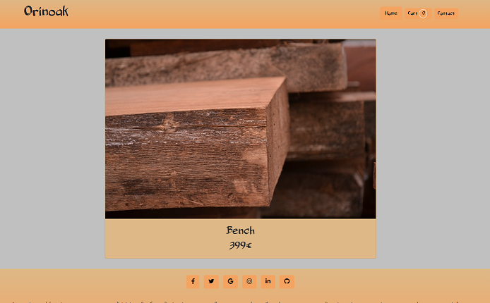

# Projet 5 Openclassrooms: Orinoco

Le projet consiste à construire un premier MVP d'un site e-commerce en JavaScript.
On est chargé de créer la partie Front-end du site, il y a trois routes pour l'API:
GET "/": qui retroune un tableau de tous les élements.
GET "/:id": qui renvoie l'élément correspondant à l'id.
POST "/order": qui récupère l'objet contact et le tableau de produits et renvoie ceux-ci avec l'"orderId".

<p align="center">

</p>

### Pré-requis

Cloner le projet,
ensuite en étant à la racine du projet  lancer

```
$cd Backend
$ npm install
$cd ../Frontend
$npm install

```

## Démarrage
Lancer le serveur sur un terminal:

```
  cd Backend
  node server
```
Et lancer le Frontend en local avec par exemple "live server" de visual studio.

## Fabriqué avec

* [Bootstrap](https://getbootstrap.com/) - CSS Frameworks


